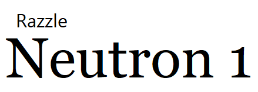
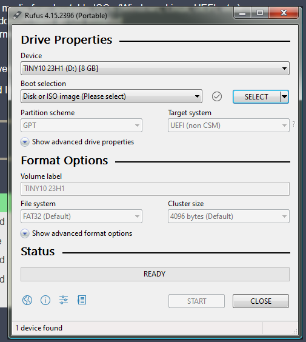
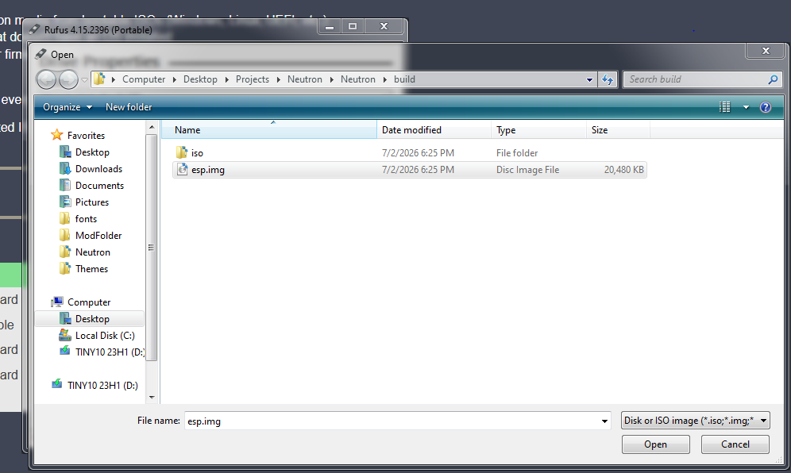
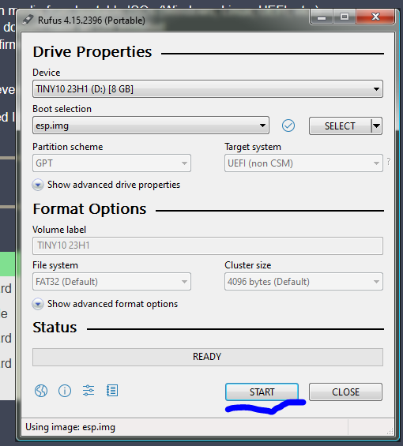

# Neutron EFI Application
A modern , Open-Source EFI Bootloader For OSDev.
A EFI Application to Load your OS!

# Compiling
## Requirement:
- mtools
- mingw64
- xorriso
- qemu + ovmf
- binutils
## compiling
MAKE SURE TO ENTER again Neutron by typing ```cd Neutron```, and type ls to see if you can see makefile, src, etc...


# Supported Environments

Below is the list of environments supported by the application.

### Linux Distributions
| Distribution Family | Examples |
| :--- | :--- |
| **Debian** | Debian, Ubuntu, Linux Mint, Kali Linux |
| **Arch** | Arch Linux, Manjaro, EndeavourOS |
| **RHEL** | Red Hat Enterprise Linux, Fedora, AlmaLinux, Rocky Linux |

### Windows Environments
| Environment | Description |
| :--- | :--- |
| **WSL2** | Windows Subsystem for Linux (Version 2) |
| **MSYS2** | [MSYS2](https://www.msys2.org/) Place where you can find anything |

## other info 
- by the way msys2 when you download qemu from msys2-ucrt, you get a free ovmf, mostly at ```C:\msys64\ucrt64\share\qemu\edk2-x86_64-code.fd```

# Installing & Testing On Real Hardware
1. Compile or download from the prerelease-releases
2. use rufus (for windows), (linux I do Not Know how to use dd), Use esp.img !!!!
### Steps:

#### 1. Open RUFUS



### 2. Select esp.img

### 3. Click START And Flash!

### 4. Reboot into your UEFI, Select your USB, then Boot Into It, And Enjoy!!

-----
# Contribution

To contribute to this project, you must follow these rules:

- **Pull Requests**: Submit all changes via Pull Requests (PRs). Ensure the PR description clearly explains the changes made.
- **Issues**: Before starting a new feature, check if there is an existing issue. If not, open one to discuss the proposed changes.
- **Testing**: Test your changes thoroughly on supported hardware/environments before submitting.
- **Documentation**: Update the documentation if your changes affect how the project is installed or used.
- **Language Policy**: While the use of casual profanity or swearing is permitted, the use of slurs or targeted insults is strictly prohibited.